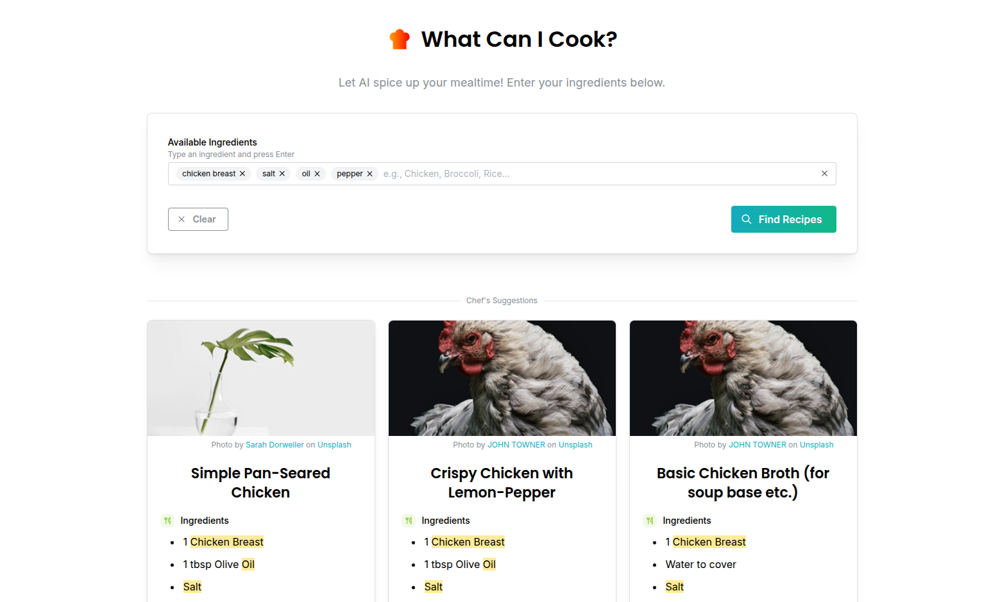
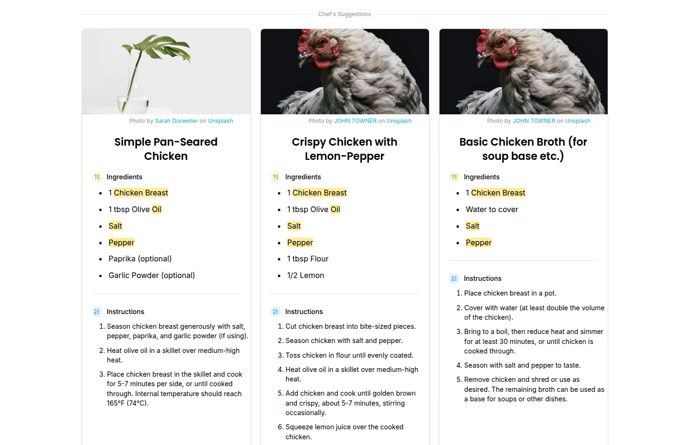
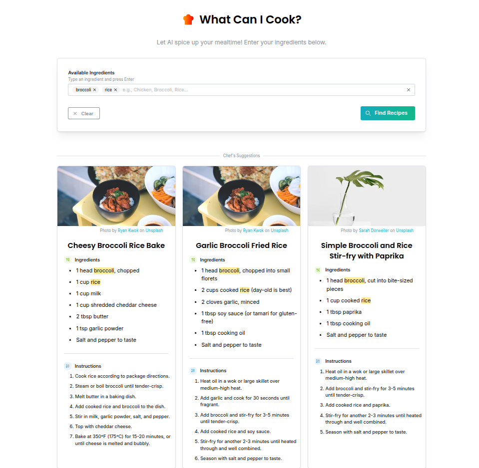

Okay, I've reviewed your `README.md` file and found the issues near the end. The main problems were artifacts likely left over from a copy/paste operation (like `IGNORE_WHEN_COPYING_START...END` comments) and an unnecessary empty code block at the very end.

Here's the corrected version:

````markdown
# What Can I Cook? - AI Recipe Suggester 🍳

This full-stack web application helps users discover recipes they can make based on the ingredients they have available, leveraging the power of Google's Gemini AI. Enter your ingredients, get recipe ideas complete with instructions and images, and reduce food waste!

[](#)

## Features ✨

- **AI-Powered Suggestions:** Utilizes the Google Gemini API to generate relevant recipe ideas (title, ingredients, instructions) based on user input.
- **Tag-Based Ingredient Input:** Uses Mantine's `TagsInput` for a clean and easy way to enter multiple ingredients.
- **Dynamic Recipe Cards:** Displays suggested recipes in a visually appealing card layout using Mantine UI.
- **Relevant Recipe Images:** Fetches and displays images related to recipe titles via the Unsplash API (includes required attribution).
- **Backend Caching:** Implements LRU caching on the backend API to reduce redundant calls to the Gemini API for identical ingredient lists, saving resources and potentially costs.
- **Input Length Validation:** Basic check on the backend estimates prompt length to prevent excessively long (and potentially expensive) API calls.
- **Loading States:** Shows skeleton loaders while recipes and images are being fetched for a smoother user experience.
- **Responsive UI:** Built with Mantine UI for usability across different screen sizes.
- **Notifications:** Provides user feedback for loading states, success, and errors using Mantine Notifications.

## Screenshots / Demo 📸





## Tech Stack 🛠️

**Frontend:**

- **Framework/Library:** React 18+
- **Build Tool:** Vite
- **UI Library:** Mantine UI (@mantine/core, @mantine/hooks, @mantine/notifications)
- **Icons:** Tabler Icons (@tabler/icons-react)
- **Package Manager:** Yarn (or NPM)
- **Language:** JavaScript (JSX)

**Backend:**

- **Framework:** Flask
- **Language:** Python 3.10+
- **Extensions:** Flask-CORS
- **Environment Variables:** python-dotenv
- **API Client:** google-generativeai
- **WSGI Server (Production):** Gunicorn / Waitress (Recommended)

**APIs:**

- **AI Model:** Google Gemini API (via `google-generativeai`)
- **Images:** Unsplash API

## Project Structure 📂

WhatCanICook_App/
│
├── backend/ # Flask Backend API
│ ├── app/ # Core application package (Blueprints, Services, Config)
│ ├── venv/ # Python Virtual Environment
│ ├── run.py # Script to run Flask app
│ ├── requirements.txt # Python dependencies
│ ├── .env # Backend Environment Variables (Secrets!)
│ └── .gitignore
│
└── frontend/ # React Frontend Application
├── public/ # Static assets (favicon, etc.)
├── src/ # React source code (Components, Services, Utils)
├── .env # Frontend Environment Variables
├── .env.example # Example Frontend Env Variables
├── package.json # Node dependencies & scripts
├── vite.config.js # Vite configuration
├── yarn.lock # Yarn lock file (or package-lock.json)
└── .gitignore

## Setup and Installation ⚙️

**Prerequisites:**

- [Git](https://git-scm.com/)
- [Node.js](https://nodejs.org/) (LTS version recommended) and [Yarn](https://yarnpkg.com/) (or npm)
- [Python](https://www.python.org/) (3.10 or higher recommended) and `pip`
- Access keys for [Google Gemini API](https://aistudio.google.com/) and [Unsplash API](https://unsplash.com/developers)

**Steps:**

1.  **Clone the Repository:**

    ```bash
    git clone <your-repository-url>
    cd WhatCanICook_App
    ```

2.  **Backend Setup:**

    ```bash
    cd backend

    # Create and activate a Python virtual environment
    python -m venv venv
    source venv/bin/activate  # On Windows use `venv\Scripts\activate`

    # Install Python dependencies
    pip install -r requirements.txt

    # Create the .env file (copy from example or create new)
    # nano .env  OR  cp .env.example .env
    ```

    Add your keys and settings to `backend/.env` (see Environment Variables section below).

3.  **Frontend Setup:**

    ```bash
    cd ../frontend # Go back to root, then into frontend

    # Install Node.js dependencies
    yarn install
    # OR: npm install

    # Create the .env file (copy from .env.example or create new)
    # cp .env.example .env
    # OR create .env manually
    ```

    Add your keys and settings to `frontend/.env` (see Environment Variables section below).

## Environment Variables 🔑

You need to create `.env` files in both the `backend` and `frontend` directories. **Do not commit these files to Git.**

**`backend/.env`:**

```dotenv
# Flask Environment (development or production)
FLASK_ENV=development

# Gemini API Key (REQUIRED)
GEMINI_API_KEY=YOUR_ACTUAL_GEMINI_API_KEY_HERE

# Allowed origins for CORS (REQUIRED for frontend communication)
# Use space-separated origins. For local dev:
CORS_ORIGINS="http://localhost:5173 http://127.0.0.1:5173"
# For production, change to your deployed frontend URL(s)
```
````

**`frontend/.env`:**

```dotenv
# URL for the backend API (REQUIRED)
# Should match where your Flask backend is running
VITE_API_URL=http://localhost:5000/api

# Unsplash API Access Key (REQUIRED for images)
VITE_UNSPLASH_ACCESS_KEY=YOUR_UNSPLASH_ACCESS_KEY_HERE
```

_(Optional): Create `.env.example` files in both directories showing the structure of the required variables without the actual secrets, and commit those example files._

## Running the Application ▶️

You need to run both the backend and frontend servers concurrently.

**Run Backend Server:**

1.  Open a terminal in the `backend/` directory.
2.  Activate the virtual environment: `source venv/bin/activate` (or `venv\Scripts\activate` on Windows).
3.  Start the Flask development server: `flask run`
    _(The backend should be running on http://localhost:5000 by default)_

**Run Frontend Server:**

1.  Open a _separate_ terminal in the `frontend/` directory.
2.  Start the Vite development server: `yarn dev` (or `npm run dev`)
    _(The frontend should be running on http://localhost:5173 by default)_

**Access the App:** Open your web browser and navigate to `http://localhost:5173`.

## Future Improvements 🚀

- Add filters for dietary restrictions, cuisine type, or meal type.
- Implement user accounts to save favorite recipes.
- "Pantry" feature to save common ingredients.
- More sophisticated image searching (e.g., using keywords from ingredients).
- Unit and integration tests for backend and frontend.
- Deployment configuration (Docker, serverless, etc.).

## License 📄

_(Maybe Later)_
